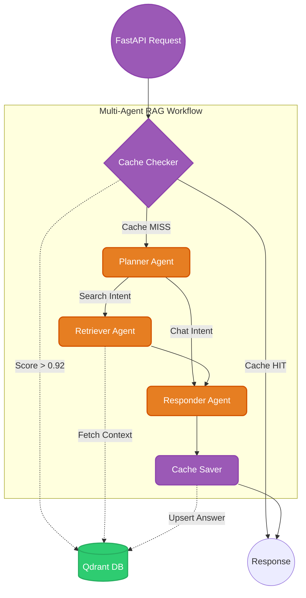

<div align="center">
  <h1>🚀 Enterprise Agentic RAG System</h1>
  <p><strong>f Backend</strong></p>
  
  <p>
    
    
    
    
  </p>
</div>

---

## 📖 Table of Contents
- [Overview](#-overview)
- [System Architecture](#-system-architecture)
- [Key Features](#-key-features)
- [Tech Stack](#-tech-stack)
- [Project Structure](#-project-structure)
- [Getting Started](#-getting-started)
- [Usage & Commands](#-usage--commands)
- [API Endpoints](#-api-endpoints)
- [Author](#-author)

---

## 🔭 Overview

The **Enterprise Agentic RAG System** is an advanced backend infrastructure designed to handle enterprise-level documentation queries intelligently. Instead of passively passing all user inputs to an LLM, this system utilizes a **multi-agent workflow (LangGraph)** to classify user intent, perform semantic caching, and trigger retrieval processes only when technically necessary. 

This architecture significantly reduces LLM latency and token costs while providing accurate and conversational responses.

---

## 🏗 System Architecture

The core logic of the application revolves around a stateful graph of agents. Below is the workflow representation:



---

## ✨ Key Features

1. **Semantic Caching Engine** 🧠
   - Employs `text-embedding-3-small` (OpenAI) to embed incoming queries.
   - If a query hits a semantic similarity threshold of `> 0.92`, the system instantly returns the cached answer. This creates a **zero-latency** experience for frequently asked questions.

2. **Smart Intent Classification** 🤖
   - The **Planner Node** evaluates the user's history and current prompt. 
   - Casual greetings bypass the vector database completely, while technical questions trigger targeted semantic searches.

3. **Universal Document Ingestion** 📚
   - Custom-built parsers seamlessly extract and chunk text from `.pdf`, `.html`, `.docx`, `.pptx`, and `.txt` files.
   - Intelligent recursive chunking ensures no contextual data is lost before vectorization.

4. **Conversational Memory** 🧵
   - Utilizes LangGraph's MemorySaver via `thread_id` to persist conversation history context across multiple API calls.

---

## 💻 Tech Stack

| Category | Technology |
|---|---|
| **Language** | Python 3.9+ |
| **Framework** | FastAPI, Uvicorn |
| **Orchestration** | LangChain, LangGraph |
| **Vector Database** | Qdrant (Cloud/Local) |
| **LLM Provider** | Groq (Llama-3-70b-versatile) |
| **Embeddings** | OpenAI (`text-embedding-3-small`) / Sentence Transformers |
| **Observability** | Logfire by Pydantic |

---

## 📂 Project Structure

```text
__8_HOUR_RAG/
├── app/
│   ├── agents/                   # LangGraph Multi-Agent Workflows
│   │   ├── nodes/                # Agent Nodes (Planner, Retriever, Responder, Cache)
│   │   ├── graph.py              # LangGraph Workflow Compilation
│   │   └── state.py              # AgentState TypedDict definitions
│   ├── ingestion/                # Data Pipeline & ETL
│   │   ├── chunking/             # Text chunking logic
│   │   ├── loaders/              # Modular document parsers (PDF, HTML, Office)
│   │   └── processor.py          # Main ingestion script to index into Qdrant
│   ├── services/                 # External Integrations
│   │   └── retrieval/            
│   │       ├── embedding.py      # OpenAI/Fallback Embedding wrapper
│   │       └── qdrant_service.py # Qdrant client connection handling
│   ├── config.py                 # Global application settings & env variables
│   └── main.py                   # FastAPI Application & Routes
├── auto_push.py                  # Utility script for Git automation
└── .env                          # Secret credentials (Not tracked in Git)
```

---

## 🚀 Getting Started

### 1. Prerequisites
Ensure you have Python installed and a functional Qdrant Cluster (either running locally via Docker or via Qdrant Cloud).

### 2. Environment Setup
Clone the repository and install the dependencies:
```bash
# Clone repo
git clone https://github.com/yourusername/enterprise-agentic-rag.git
cd enterprise-agentic-rag

# Create virtual environment (recommended)
python -m venv venv
source venv/bin/activate  # On Windows: venv\Scripts\activate

# Install dependencies (assuming requirements.txt exists)
pip install -r requirements.txt
```

### 3. Configuration (.env)
Create a `.env` file in the root directory. Configure the following keys:
```env
# Vector Database
QDRANT_CLUSTER_ENDPOINT=https://your-cluster-url.qdrant.tech
QDRANT_API_KEY=your_qdrant_api_key

# Language Models
OPENAI_API_KEY=sk-your_openai_api_key
GROQ_API_KEY=gsk_your_groq_api_key

# Observability
LOGFIRE_TOKEN=your_logfire_token
```

---

## ⚙️ Usage & Commands

### 📥 Data Ingestion
To populate the knowledge base with your enterprise documents, create a directory named `DATA`, place your files inside, and execute the ingestion script:

```bash
# Run ingestion pipeline
python -m app.ingestion.processor DATA

# To wipe the existing Qdrant collection before ingestion, use the --wipe flag
python -m app.ingestion.processor DATA --wipe
```

### 🏃‍♂️ Running the API Server
Start the local FastAPI development server:
```bash
uvicorn app.main:app --reload
```
The server will start at `http://127.0.0.1:8000`.

---

## 🌐 API Endpoints

### `GET /`
Health check endpoint.
**Response:**
```json
{
  "messages": "Enterprise yang dibuat oleh farhan sudah nyala"
}
```

### `GET /graph`
Generates a visual PNG representation of the LangGraph workflow structure.
**Response:** Image (PNG)

### `POST /query`
Main endpoint for the Agentic RAG system.
**Request Body (JSON):**
```json
{
  "q": "What is the architecture of Kubernetes?",
  "thread_id": "user_123"
}
```
**Response (JSON):**
```json
{
  "question": "What is the architecture of Kubernetes?",
  "answer": "Kubernetes consists of a Control Plane and Worker Nodes...",
  "thought_process": ["Intent: Technical", "Search Term: Kubernetes architecture"],
  "status": "Response generated.",
  "sources": ["architecture_docs.pdf"]
}
```

---

## 👨‍💻 Author
**Farhan Kamil**  
*Informatics Engineering Student at ITENAS | AI & Backend Enthusiast*
"# enterprise-agentic-rag-with-cache" 
